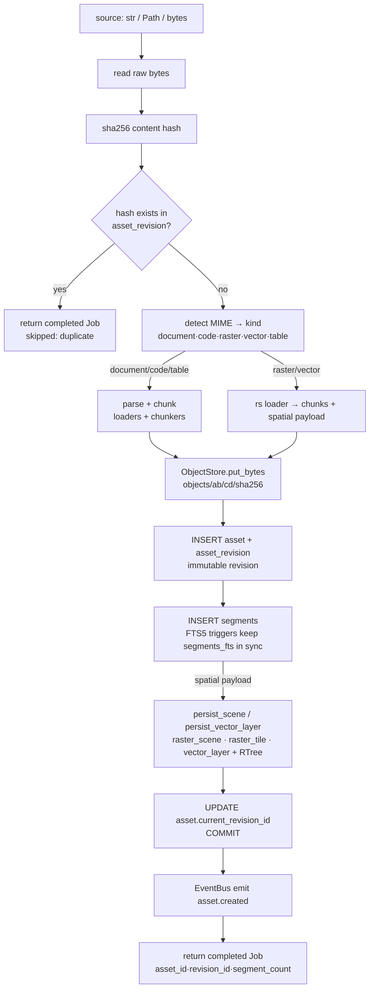
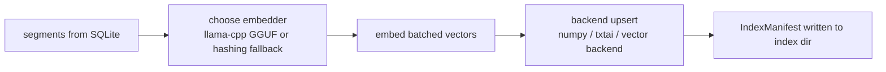
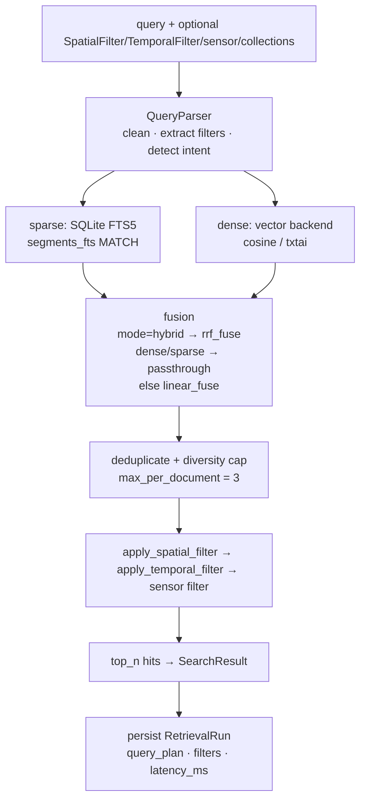
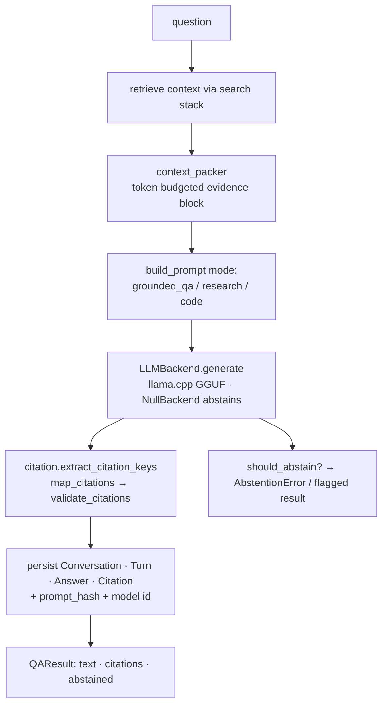
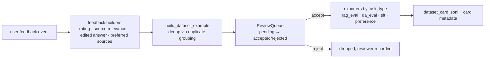

# Data Flow — Current State

Status: as-is, `main` @ `364b897`.

## 1. Ingestion (synchronous path — `GeoMemory.ingest`)

`core/workspace.py:208` `Workspace.ingest(source, collection_id, *, parser=None, index_after=True) -> Job`

Notes:
- `parser_version="0.1.0"` is stamped on every revision.
- The async-shaped path is `services/ingestion_service.py`: `ingest()` inserts a `pending` job row and returns it; actual work still runs when `JobQueue.run(job_id, fn)` is invoked by the caller.

## 2. Index build (`IndexService.build`, exposed as `GeoMemory.build_index(space_id)`)

- Space ids isolate modality: text spaces vs vision spaces; never mixed.
- `rebuild_index()` drops and reconstructs from DB via `RetrievalBackend.rebuild(manifest)`.
- Image side: `ImageIndex` stores vision embedding vectors keyed by target id; persisted with its own manifest under `<index_dir>/image`.

## 3. Search (`GeoMemory.search` → retrieval stack)

- Workspace keeps an internal `_WorkspaceSearchAdapter(SearchService)` so collection-scoped searches reuse the same orchestration (`core/workspace.py:964`).
- Hit metadata carries locator, sensor, spatial payload used by filters and citations.

## 4. Ask / grounded QA (`GeoMemory.ask`)

## 5. Feedback → dataset export loop

## 6. Evaluation (`eval/`)

`BenchmarkRunner.run(benchmark_path, config)` loads JSONL benchmark items → for each item runs retrieval (`search`) and/or QA (`ask`) → aggregates recall@k/precision@k/mrr@k/ndcg@k and QA metrics → reporter emits JSON or Markdown. Driven by CLI `geomemory eval run` and `scripts/run_phase1_benchmark.py`.

## 7. Cross-cutting flows

- **Provenance chain**: `asset → asset_revision(hash) → segment(locator) → citation(answer)` — every answer traceable to source bytes in `objects/`.
- **Events**: only `asset.created` is emitted today; bus has no internal subscribers (fire-and-forget extension point).
- **Jobs**: `job` table rows record state/progress/checkpoint; used by ingestion service and CLI feedback loops; execution is synchronous.
