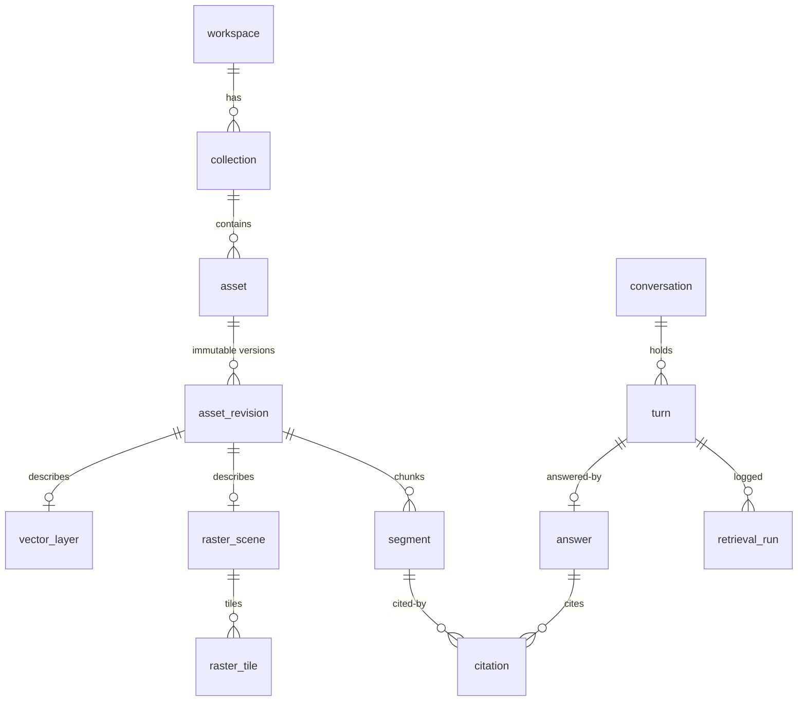

# Database Schema — Current State

Source of truth: `src/geomemory/storage/schema.sql` (schema version 1). Applied by `storage/database.initialize()`; versioned upgrades tracked via `storage/migrations.py` and `schema_migration(version, applied_at, description)`.

Connection profile (`database.connect`): SQLite **WAL**, `PRAGMA foreign_keys = ON`.

## Entity overview (22 tables + 2 virtual)



## Tables

### Workspace & collections
| Table | Key columns | Notes |
|---|---|---|
| `workspace` | id PK, name, settings JSON | single-row in practice |
| `collection` | id PK, workspace_id FK CASCADE, name, description, archived | indexed on workspace_id |

### Assets & revisions
| Table | Key columns | Notes |
|---|---|---|
| `asset` | id PK, collection_id FK, kind CHECK(document/code/raster/vector/table), title, current_revision_id, deleted_at, metadata JSON | soft-delete via deleted_at; kind index |
| `asset_revision` | id PK, asset_id FK, hash, mime_type, size_bytes, parser_version, metadata | UNIQUE(asset_id, hash); hash-indexed for dedup lookup |

### Segments & sparse search
| Table | Key columns | Notes |
|---|---|---|
| `segment` | id PK, revision_id FK CASCADE, segment_type CHECK(paragraph/table/formula/code_unit/heading/cell), text, locator JSON, parent_section_id, neighbor_ids JSON, metadata JSON | indexes: revision, type |
| `segments_fts` | FTS5 virtual table, external content = `segment`, tokenizer `unicode61 remove_diacritics 1` | kept in sync by triggers `segments_ai/ad/au` |

### Spatial index
| Table | Key columns | Notes |
|---|---|---|
| `spatial_entity` | rowid INTEGER PK AUTOINCREMENT, entity_id TEXT UNIQUE | maps TEXT ids ↔ RTree integer rowid |
| `spatial_index` | RTree virtual table: id, min_lat, max_lat, min_lon, max_lon | bbox-only (lat/lon degrees) |

### Remote sensing
| Table | Key columns | Notes |
|---|---|---|
| `raster_scene` | id PK, revision_id FK, sensor, bands JSON, crs CHECK(EPSG:%), footprint, bbox JSON, acquired_at, transform, dtype, nodata, width/height, resolution_m | indexed: revision, sensor, acquired_at |
| `raster_tile` | id PK, scene_id FK CASCADE, window, transform, footprint, preview_path | indexed: scene |
| `vector_layer` | id PK, revision_id FK, geometry_type CHECK(7 OGC types), crs, footprint, feature_count | indexed: revision |

### Observations & knowledge graph
| Table | Key columns | Notes |
|---|---|---|
| `observation` | id PK, subject_id+subject_type, metric, value REAL, unit, observed_at, valid_from/to | time-series facts; indexes subject/metric/time |
| `embedding_record` | PK(target_id, target_type, space_id), model_id, dimension, checksum | registry of what is embedded with which model/space; vectors live in index dirs |
| `relation` | id PK, source_id, predicate, target_id, confidence, extractor, evidence_id | generic triple store (manual extractor default) |

### Conversations & QA
| Table | Key columns | Notes |
|---|---|---|
| `conversation` | id PK, workspace_id FK, collection_scope JSON, title | |
| `turn` | id PK, conversation_id FK, role CHECK(user/system/assistant), content | |
| `retrieval_run` | id PK, turn_id FK nullable, query, query_plan JSON, filters JSON, config JSON, candidates/results JSON, latency_ms | full audit of every search |
| `answer` | id PK, turn_id FK, model, prompt_hash, text, abstained | |
| `citation` | id PK, answer_id FK, segment_id FK→segment, locator JSON, claim_span | provenance edge answer→segment |

### Feedback, datasets, jobs
| Table | Key columns | Notes |
|---|---|---|
| `feedback_event` | id PK, target_type/target_id, actor, label, payload JSON | append-only raw events |
| `dataset_example` | id PK, task_type, source_feedback_ids JSON, review_state CHECK(pending/accepted/rejected), reviewer_id, version, dataset_card | review workflow state machine |
| `job` | id PK, type, state CHECK(pending/running/completed/failed/cancelled), progress REAL, input/result/error/checkpoint JSON | DB-backed queue |

## Object store layout (filesystem)

```
workspace/objects/<aa>/<bb>/<sha256-hex>     # put_bytes/put_file → hash; immutable
```

`core/hashing.hash_object_path()` defines the 3-level shard. `ObjectStore` exposes put/get/get_path/exists/delete/size/total_objects.

## Repositories (`storage/repositories/`)
`base.py` (row mapping helpers), `asset_repo`, `segment_repo`, `embedding_repo`, `spatial_repo` (RTree + spatial_entity mapping), `conversation_repo`, `feedback_repo`. Raw SQL with bound parameters throughout — no ORM.
