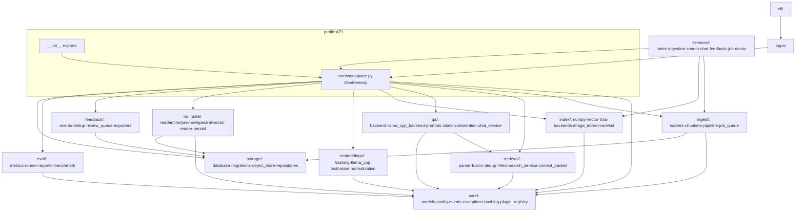

# Dependency Graph — Current State

## 1. Runtime dependencies (base install — deliberately tiny)

`pyproject.toml [project.dependencies]`: **pydantic≥2, numpy≥1.24, click≥8, PyYAML≥6**

Everything heavy is opt-in:

| Extra | Packages | Used by |
|---|---|---|
| `ai` | txtai≥8, llama-cpp-python≥0.2 | `index/txtai_backend.py`; `embeddings/llama_cpp_text|vision.py`; `qa/llama_cpp_backend.py` |
| `docs` | pymupdf≥1.23, python-docx≥1.0 | `ingest/loaders/pdf.py`. ⚠️ docx listed but **no docx loader exists** (see tech-debt) |
| `rs` | rasterio≥1.3, shapely≥2.0, geopandas≥0.14, Pillow≥10 | `rs/raster/*`, `rs/vector/reader.py`, previews |
| `vision` | Pillow≥10 | image decode for vision embedder |
| `ui` | streamlit≥1.30 | `apps/*` |
| `dev` | pytest, pytest-cov, mypy, ruff, types-PyYAML | tooling |

Heavy imports are function-local (`import rasterio` inside readers, etc.) so base import of `geomemory` stays fast and dependency-free.

## 2. Internal module graph (imports)

Key structural facts (from call/import graph):

- `core/workspace.py` is the highest fan-out module (~everything depends on it; it delegates to all domain packages). Fan-in 348 / fan-out 260 at package level.
- Hottest symbols: `Workspace.create_collection`, `Workspace.close`, `Workspace.ingest`, `VectorBackend.search`, `ChatService.ask`, `ReviewQueue.get`.
- No cycles between packages; `qa → retrieval` is the only cross-domain downward dependency.
- Tests: 393 TESTS edges; `tests/unit` + `tests/integration` exercise `geomemory` directly (229 + 77 calls).

## 3. Toolchain

Python ≥3.10 · setuptools build · ruff (E/F/W/I/N/UP/B/SIM, line-length 100) · mypy `--strict` (src only) · pytest `--strict-markers` with markers `unit/integration/golden/e2e/spike` · coverage fail-under 80.

No CI configuration exists in-repo (no `.github/workflows`) — quality gates run manually or via local hooks.
